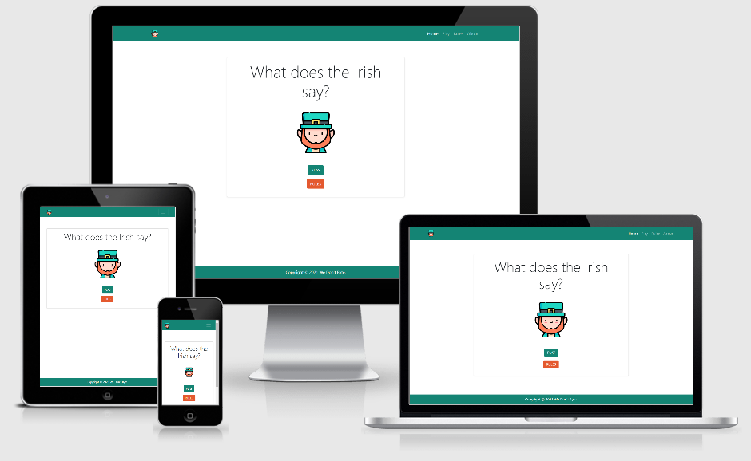
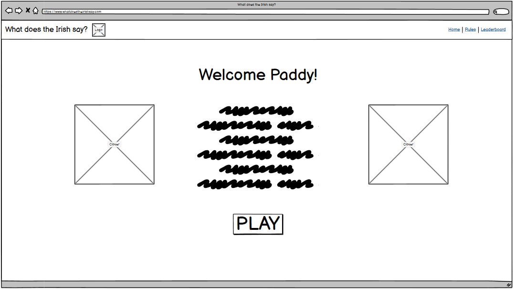
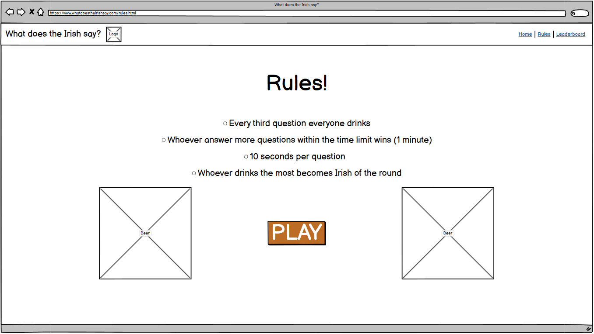
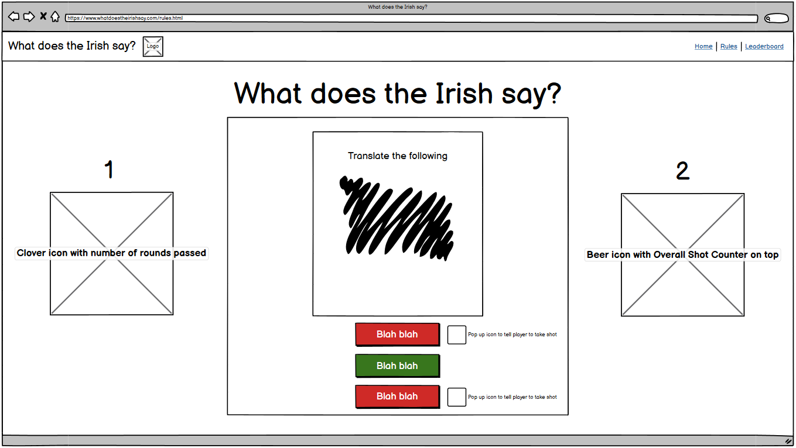
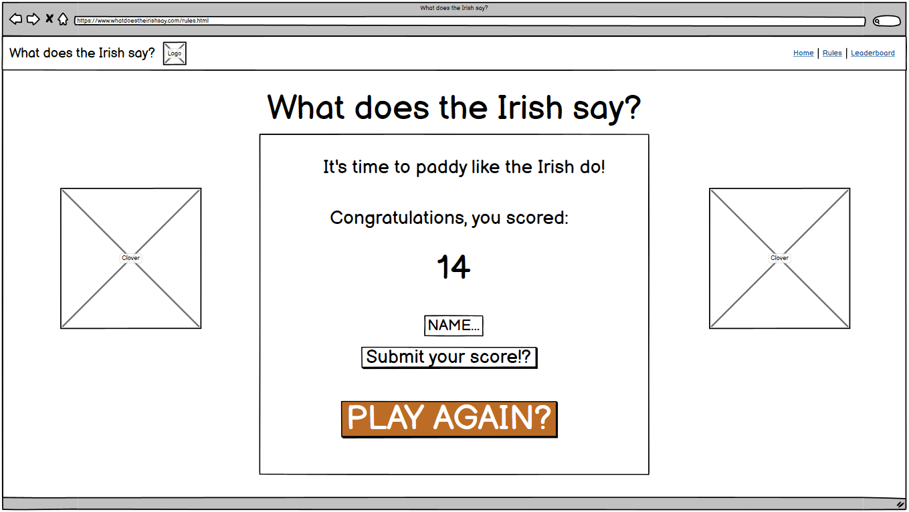

# What does the Irish say?



  

___
## Table of Contents
1. [Introduction](#Introduction)
2. [UX](#UX)
    1. [Ideal User Demographic](#Ideal-User-Demographic)
    2. [User Stories](#User-Stories)
    3. [Development Planes](#Development-Planes)
    4. [Design](#Design)
3. [MVP](#MVP)
4. [Technologies Used](#Technologies-Used)
5. [Testing](#Testing)
6. [Deployment](#Deployment)
7. [Credits](#Credits)

___
## Introduction

This abstract web-based game was designed for the purpose of celebrating St. Patrick's day in a fun and friendly manner, can be played solo or with friends!

The focus of this site is to give the users some fun bite-sized Irish words that they have to guess correctly, if they fail, they must drink up like a true Irishman.

This allows the users to both have great fun, but also to educate players on old Irish languages, whilst sticking with the theme of St. Patrick's!

___
## UX

### Ideal User Demographic
#### The ideal user of this website are:
- Drink Lovers
- Irish Residents
- St. Patrick Celebrators 

### User Stories
#### User Goals;
1. As a Drink Lover, I want to be able to easily navigate through the site easily, even when drunk.
2. As a Drink Lover, I want to be able to simply be able to follow the flow of the sites' design.
3. As a Drink Lover, I want to be able to visit and read the rules clearly.
4. As a Drink Lover, I want to be enaged with the interactivity of the site and have fun.
5. As a Drink Lover, I want an excuse to be able to get seemingly drunk to celebrate St. Patrick's Day.

#### Irish Residents
1. As an Irish Resident, I want to visit a site with Irish traditional design and influence.
2. As an Irish Resident, I want to celebrate St. Patrick's Day, the proper Irish way.

#### St. Patrick day Celebrators
1. As an St. Patrick day Celebrator, I want to visit a fun and friendly environment to celebrate St. Patrick's Day.
2. As an St. Patrick day Celebrator, I want to interact with others and celebrate as a party.
2. As an St. Patrick day Celebrator, I want to drink!


### Development Planes
In order to create an abstract and fun web-based game, the developers worked towards Irish tradition for St. Patrick's Day to distinguish the required functionality of the site and how it would answer the user stories, as described above.

#### Strategy
Broken into three categories, the web-based game will focus on the following target audiences:
- **Roles:**
    - Irish Residents
    - Drink Lovers
    - St. Patrick's day Celebrators

- **Demographic:**
    - 18+ year olds
    - University Students
    - Pub goers
    - Proud Irishmans 

- **Psychographics:**
    - Personality & Attitudes:
        - Traditional
        - Outgoing
        - Youthful
    - Values: 
        - More traditional lifestyle
        - Leaning towards Irish values of culture
    - Lifestyles:
        - Drink Lovers
        - Game Party Lovers
        - Interested in Irish culture

The web-based game needs to enable the **user** to:
- Have Fun
- Celebrate St. Patrick's day 
- Drink 
- Interact with others (optional)

#### Scope
A scope was defined in order to clearly identify what needed to be done in order to align features with the strategy previously defined. This was broken into two categories:
- **Content Requirments**
    - Irish Abstract Design
    - Interactive Irish Bite-Size Card guessers
    - Leaderboard
    - Rules 
    - Easily Pressible Buttons
- **Functionality Requirements**
    - Google API Irish Translator
    - Generative Irish Card questions and options
    - Database for Leaderboards

#### Skeleton
Wireframe and prototype mockups were created in a [Figma Workspace](https://www.figma.com/file/cupQQiCICQGkyehHDUXxCx/What-does-the-Irish-say?node-id=0%3A1) Balsamiq and with providing a positive user experience in mind:

Home Page:



Rules Page:



Gameplay Pages:



Leaderboard Page:



### Design

#### Color Scheme
The main colours used throughout the website are a mixture of Irish greens, with hints of orange.

[Colour Scheme](static/media/color-scheme/color-scheme.png) <br>

The chosen colour scheme is a reflection of the Irish Culture and St. Patrick's day.

#### Imagery
The selected imagery is abstract and aesthetic, reflecting the Irish culture. 

The imagery is catching and visually represents the theme of the St. Patrick's day.

[SVG Images](https://www.flaticon.com/packs/st-patricks-day-7?k=1614892532205)

___
## MVP

### Design Features
Each page of the website features a consistent responsive navigational system:
- The **Header** contains a conventionally placed **logo** in the top left of the page (whereby by clicking this will redirect users back to the home page) and **navigation bar** in the top right of the page.
- On smaller screens, the navigation bar collapses into a **toggler** icon whereby clicking it will reveal the navigation and social links.

### Existing Features
- Interactive Bite-Sized Game with Generative Functions
- Global Leaderboard
- Score Counters
- Drink Counters

### Features Left to Implement
- Hard Difficulty Mode 
- Multiplayer Mode
    - Local Party 
    - Online

___
## Technologies Used

Throughout the project, the following technologies were used.

- [HTML5](https://developer.mozilla.org/en-US/docs/Web/Guide/HTML/HTML5)
- [CSS3](https://developer.mozilla.org/en-US/docs/Archive/CSS3)
- [JavaScript](https://www.javascript.com/)
- [Bootstrap 5](https://getbootstrap.com/)
- [Python](https://www.python.org/)
- [Flask](https://flask.palletsprojects.com/en/1.1.x/)
- [mongoDB](https://www.mongodb.com/)

___
## Testing
### Testing User Stories 

The project was tested in the following way:
1. Home Page:
  First of all, I checked all the options on the menu bar by clicking on them one by one.
  Next, I tested both buttons ( play and rules) and their responsiveness.
2. Play section:
  I played several complete rounds to check whether the game mechanics work properly.
3. Rules page:
  I clicked on the menu option that should redirect the user to the rules page and then, also clicked on this section's button that should redirect to the game.
4. About page:
  Finally, I selected the about section and tested the navigation icons to the repository and social media: Github, Linkedin.
  
I also took the chance to repeat all the above mentioned processes on different devices ( Smartphone, Chromebook and PC ) and several browsers, such as: Mozzila Firefox, Internet Explorer, Chrome and Opera.

___
## Deployment

The website is hosted and deployed by [Heroku](https://www.heroku.com/home).
Everything is deployed from the master branch and updates automatically whenever the branch is updated in GitHub.

1.  Log in Heroku (or create a new one if you don't have one.);
2.  Go to your dashboard.
3.  Click on the "New"  -> "Create new app" button located right under the navbar.
4.  Choose a unique name for your app.
5.  Choose a region (preferably close to where you are located).
6.  If everything works fine you should see the overview page of your app.
7.  Click on Settings tab.
8.  Reveal Config vars.
9.  Here we configure the IP, MONGO_DBNAME, MONGO_URI, PORT, SECRET_KEY, GOOGLE_APPLICATION_CREDENTIALS (set to google-credentials.json) and GOOGLE_CREDENTIALS (should match your google-credentials.json)values (thoose are  not public and are the same values on my env.py and file (which is also private)).
10. On the builkdpacks area click add buildpack and paste (https://github.com/buyersight/heroku-google-application-credentials-buildpack.git)
11. Click on deploy tab.
12. In the case of this project I chose to conect my app to my repository in GitHub, so it auto updates my heroku app whenever the project is pushed. 
13. Click on the Deploy Branch button. 
14. DONE!

### Forking
If you want to fork the repository to your own GitHub account you can by clicking on the “fork” button under the navbar with your profile.

### Cloning

 1. If you want to clone the repository into a local file you can by:
 2. Clicking on the green button “Code” and copying the url showed.
 3. Open GitBash
 4. Change directory to the desired location where you want to clone the
    files to.
 5. Type “git clone” and paste the copied URL
 6. Press enter and you should have your local file cloned and ready.
 7. After opening the folder you should create a new file in the root directory, name it env.py
 8. In env.py you can set your environment variables.  
 9. Create a file called google-credentials.json on the project root and paste your google credentials into it. For more information checkout [Google Credentials](https://console.cloud.google.com/apis/credentials)
 10. 
    ``` import os
      import os

      os.environ.setdefault("IP", "<your value>")
      os.environ.setdefault("PORT", "<your value>")
      os.environ.setdefault("SECRET_KEY", "<your value>")
      os.environ.setdefault("MONGO_URI", "<your value>")
      os.environ.setdefault("MONGO_DBNAME", "<your value>") 

___
## Credits

Thiago Hardt - [LinkedIn](https://www.linkedin.com/in/thiago-hardt/)

Aidan Walsh - [LinkedIn](https://www.linkedin.com/in/aidancgart/)

Jakub Ostaszewski - [LinkedIn](https://www.linkedin.com/in/jakub-ostaszewski-22403a164/)